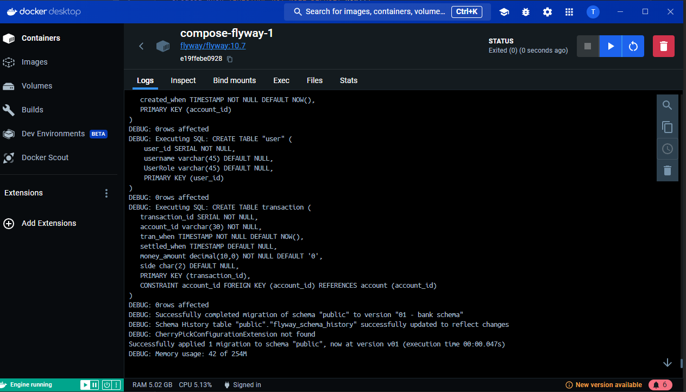

Integration testing tool for core bank service (demo)
---
## Prerequisites

1. Install docker in your local machine [install docker](https://docs.docker.com/desktop/install/)
2. Execute docker, either run docker desktop or in console. Check `docker ps ` command works in your command prompt.
3. Make sure your local machine is not running any programs at the same port. You may change your port programmatically.
4. Download this repository "integration-testing-tool".
5. Run BankIntegrationTestingApplication after setting the properties like below.

(Optional)
6. Download bank-core-system repository to utilize integration testing tool features.
[BankCoreDemo](https://github.com/MarcoBackman/bankcoresystem.git)

---

## Java Spring configuration

- Set active profiles = local, docker-compose
---


## Docker PSQL

### Environment variables for DB

Set db configs as environment variables like below.
```
DB_NAME=bank-demo;
DB_PASSWORD={your_db_pass};
DB_USER={your_db_user_name};
SQL_SCRIPT_PATH={your_sql_script_file_path};
```

### Test local PSQL
1. Check if you can access to local PSQL
    

2. see if sql scripts are automatically injected as intended.
    **(Todo - add default scripts for bank-demo)**

---

### Check docker instances are running correctly.
 

---

### Test Kafka
First check if docker images(zookeeper, kafka, kafka-ui) are running

Enter this url in your browser to see kafka ui with a broker online
[Local host kafka-ui(port 8080)](http://localhost:8080/ui/clusters/)


### Test flyway for your script validation
When your environment variable for sql script path(`${SQL_SCRIPT_PATH}`) is set correctly, then flyway will give you the results of the script validation.



Please follow the link for additional information on flyway script file naming convention.

[Flyway naming convention link](https://www.red-gate.com/blog/database-devops/flyway-naming-patterns-matter)
