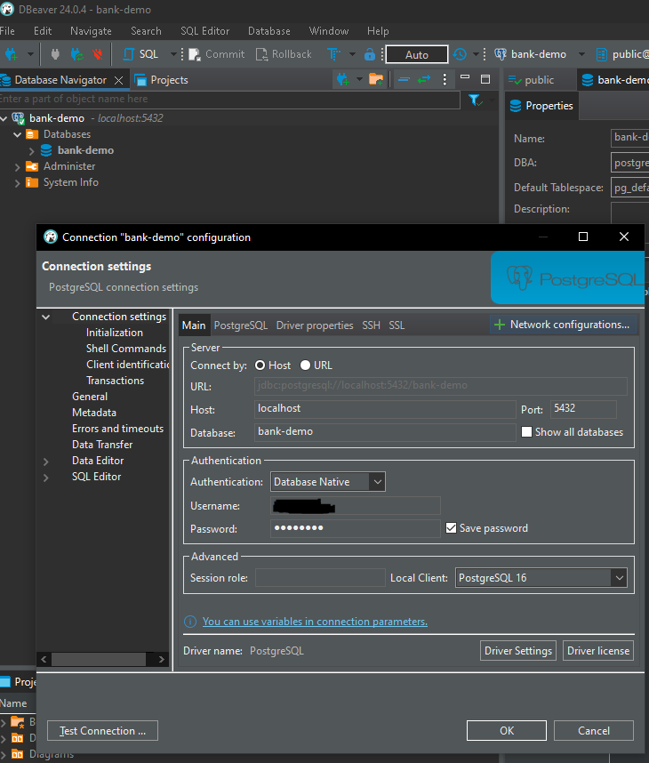
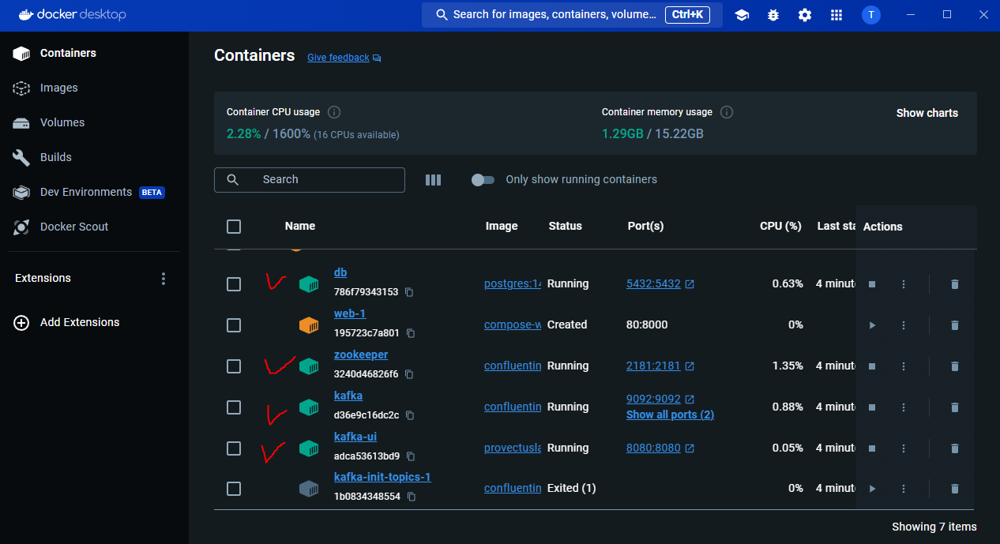
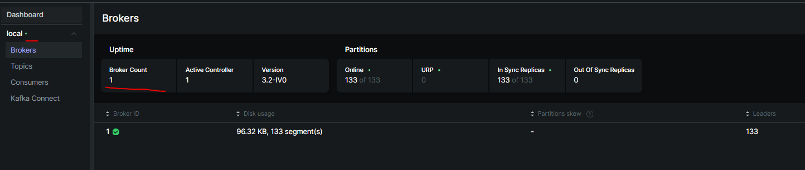

Integration testing tool for core bank service (demo)
---
## Prerequisites

1. install do**cker in your local machine [install docker](https://docs.docker.com/desktop/install/)
2. install ka**fka service "# integration-testing-tool" 

---

## Java Spring configuration

- Set active profiles = local, docker-compose
---


## Docker PSQL

### Environment variables for DB

Set db configs as environment variables like below.
```
DB_NAME=bank-demo;
DB_PASSWORD={your_db_pass};
DB_USER={your_db_user_name};
SQL_SCRIPT_PATH={your_sql_script_file_path};
```

### Test local PSQL
1. Check if you can access to local PSQL
    

2. see if sql scripts are automatically injected as intended.
    **(Todo - add default scripts for bank-demo)**

---

### Check docker instances are running correctly.
 

---

### Test Kafka it runs well
First check if docker images(zookeeper, kafka, kafka-ui) are running

Enter this url in your browser to see kafka ui with a broker online
http://localhost:8080/ui/clusters/


